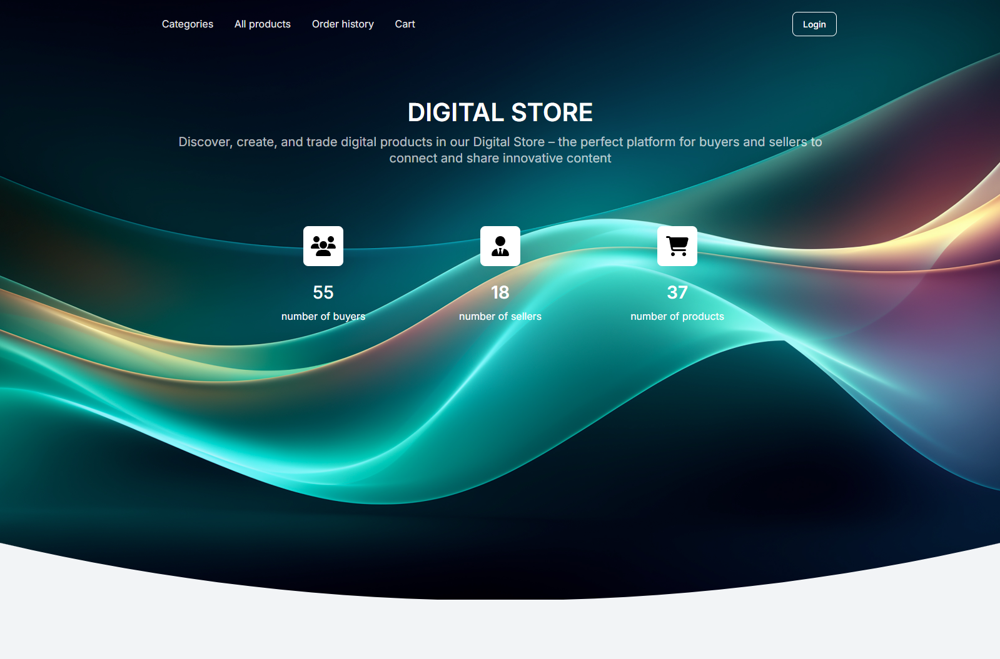

# Digital store project

## Description:

This project is a small digital online store. The set of actions varies depending on your role selected during registration. Buyers are limited to viewing and ordering goods only. Sellers can additionally create goods and categories of goods.

Link on live page: https://digital-goods-app.onrender.com/

User for testing: 
```
login: testuser
password: testuser12345
```

At the moment, the following has been implemented:

- ✅**Home page** → has a navigation bar at the top, as well as a button for login/logout;
- ✅**Category list** → list of categories (at the moment this is only a list, not a filter)
- ✅**Product list** → list of all goods (maximum 12 product cards per page)
- ✅**Product detail** with detailed information about the product
- ✅**Forms** for creating, editing and deleting categories and goods (only sellers!)
- ✅**Order list** → list of orders
- ✅**Cart** → page with a list of selected goods for order confirmation

## How to run the project:
1. Clone the repository: 
```
git clone https://github.com/YaroslavBordovoy/digital-goods-app.git
```
2. Install env and dependencies::
```
python -m venv venv
venv\Scripts\activate (on Windows)
source venv/bin/activate (on macOS)
pip install -r requirements.txt
```
3. Install migrations:
```
python manage.py migrate
```
4. Start the server:
```
python manage.py runserver
```
5. To quickly fill the database, run the command:
```
python manage.py populate_db
```
6. (Optional) Tests are run with the command:
```
python manage.py test
```

## Features
- User Registration/Authentication
- Category and product management for sellers using the application interface
- Functional shopping cart with the ability to change the number of products and place orders

## Further steps in the development of the project
- Add forms for searching for products
- Add product filtering by categories
- Add the ability to go from the category page to the corresponding products
- Update forms for creating categories and products
- Update favicons and product images
- Improve the order history, making it more informative
- Add additional tests
- ⚙️ (Potentially) Add functionality for processing orders by sellers

# Demo

